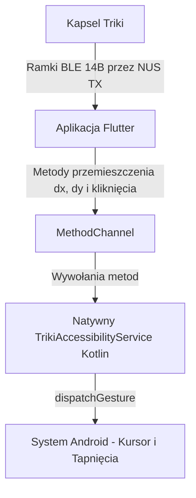

# Podsumowanie Projektu: Triki Mouse 🐾

Niniejszy dokument stanowi kompletny opis techniczny i operacyjny mobilnego systemu sterowania systemowego na Androidzie za pomocą kontrolera do gier **Triki od Żabki**.

---

## 🏗️ Architektura i Przepływ Danych



### 1. Protokół BLE (Nordic UART Service)
* **UUID Usługi:** `6e400001-b5a3-f393-e0a9-e50e24dcca9e`
* **UUID RX (Zapis komend):** `6e400002-b5a3-f393-e0a9-e50e24dcca9e`
* **UUID TX (Notyfikacje):** `6e400003-b5a3-f393-e0a9-e50e24dcca9e`
* **Komenda Startowa:** `201000D007680003` (Hex, wysyłana na RX do uruchomienia strumieniowania).
* **Usługa Baterii:** `0000180f-0000-1000-8000-00805f9b34fb` (Odczyt poziomu baterii).

### 2. Format Ramki (14 bajtów)
* `frame[0]`: `0x22` (Nagłówek ramki)
* `frame[1]`: Stan fizycznego przycisku (`0x00` = puszczony, `0x01` = wciśnięty)
* `frame[2..3]`: Żyroskop X (Little Endian, znakowany)
* `frame[4..5]`: Żyroskop Y (Little Endian, znakowany)
* `frame[6..7]`: Żyroskop Z (Little Endian, znakowany)
* `frame[8..9]`: Akcelerometr X (Little Endian, znakowany)
* `frame[10..11]`: Akcelerometr Y (Little Endian, znakowany)
* `frame[12..13]`: Akcelerometr Z (Little Endian, znakowany)

---

## 🛠️ Funkcjonalności Myszki (Modyfikacja `lib/main.dart`)

* **Tryb Powietrzny (Air Mouse):** Wykorzystuje obrót urządzenia w przestrzeni (Żyroskop). Zastosowano regulowaną martwą strefę (Deadzone) w celu niwelowania mikro-drgań.
* **Tryb Stołowy (Table Mouse):** Wykorzystuje przyspieszenie liniowe z akcelerometru. Prędkość kursora jest obliczana za pomocą podwójnego całkowania z zastosowaniem dynamicznego tarcia (damping) o wartości `0.82` zapobiegającego odpływaniu kursora.
* **Kompas Przycisków (Orientacja):** Remapowanie osi ruchu w zależności od pozycji czerwonego przycisku na obudowie (W lewo, Do mnie, W prawo).
* **Fizyczny Klik i Gesty:** 
  * Krótkie kliknięcie (<400ms) = Lewy Przycisk Myszy (LPM)
  * Podwójne kliknięcie (2x <400ms) = Double Click
  * Długie kliknięcie (>550ms) = Prawy Przycisk Myszy (PPM)
  * Przytrzymanie i przechylenie (>300ms + tilt) = Scroll (przewijanie)
* **Profile urządzeń:** Aplikacja zapamiętuje ustawienia czułości dla 5 ostatnich kapsli.
* **Auto-reconnect:** System automatycznie ponawia próby połączenia (do 5 prób ze wzrastającym opóźnieniem).

---

## 🎮 Minigry Wbudowane (`lib/games_page.dart`)
Sterowane żyroskopem z odświeżaniem ~200Hz. Gdy gra jest aktywna, tryb myszy zostaje wstrzymany.
* **Catch the Dot:** Gra na czas (30s). Kursor sterowany żyroskopem musi "złapać" punkty.
* **Gyro Pong:** Paletka gracza sterowana osią żyroskopu, gra do 5 punktów przeciwko sztucznej inteligencji.
* **Żabka łapie muchy:** Oparta na żyroskopie, gdzie celem jest "celowanie" w insekty i fizyczne kliknięcie na kapslu, by je złapać w locie.

---

## 📲 Integracja z Systemem Android

* **`TrikiAccessibilityService.kt`:** Natywna usługa dostępności działająca w tle. Tworzy na ekranie wirtualny kursor za pomocą typu okna `TYPE_ACCESSIBILITY_OVERLAY` i steruje jego położeniem. Obsługuje nowe gesty: scrollowanie i długie naciśnięcia.
* **`MainActivity.kt`:** Obsługuje `MethodChannel` (`pl.kawak.triki_app/mouse`) zapewniający komunikację kodu Dart z natywnym serwisem Androida, w tym wyświetlanie stałego (persistent) powiadomienia o stanie połączenia i poziomie baterii.

---

## 🤖 Wdrożenie i Skrypty Automatyzacji (Workflow)

Wdrożenie opiera się na maszynie kompilacyjnej (Minionek), a plik `deploy_workflow.sh` automatycznie:
1. Podbija wersję w `pubspec.yaml` (wersja + build).
2. Buduje zoptymalizowany APK (`flutter build apk --release`).
3. Przenosi najnowsze kody źródłowe na Gitea i GitHub za pomocą `git push`.
4. Tworzy Release i Tag za pomocą API (Gitea API, GitHub CLI) i przesyła na serwery nową paczkę z odpowiednią nazwą (np. `triki-myszka_v1.0.1.apk`).

### Zdalne wywołanie wdrożenia z Termuxa:
```bash
rsync -avz --exclude='build/' --exclude='.dart_tool/' --exclude='.idea/' --exclude='android/.gradle/' --exclude='local.properties' ~/projekty/zabka/triki_app/ minionek:~/projekty/zabka/triki_app/

ssh minionek "bash ~/projekty/zabka/triki_app/deploy_workflow.sh"
```
